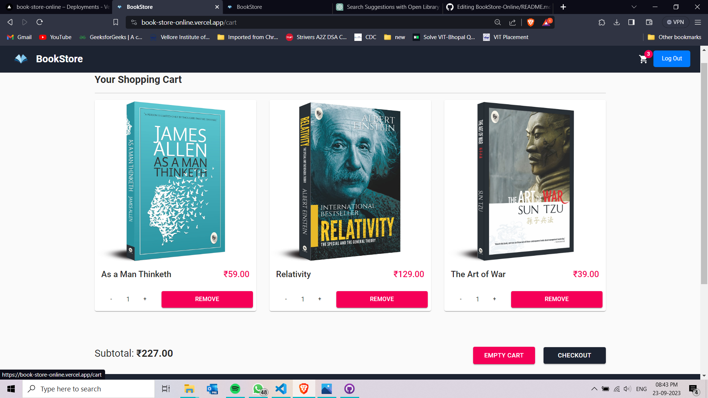
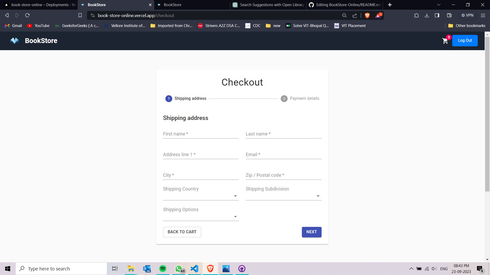

<h1 align="center">BookStore USING REACTJS </h1>

BookStore is a dynamic online React-based platform designed for book enthusiasts. 
This web application empowers users to explore an extensive collection of books, 
conveniently search for titles they desire, and seamlessly add their selected reads to a virtual shopping cart.

**Live Demo**: [book-store-online.vercel.app](https://book-store-online.vercel.app/)

A feature-rich library management web application with a sleek and user-friendly interface, optimized for book lovers, complete with advanced functionalities such as user authentication, book search, filtering, sorting, and a shopping cart.

## Features

### Aesthetically Pleasing Loading Animation

- Engage users with an appealing loading animation during data fetch.

### User Authentication

- User signup and login functionality with proper authentication and session management.
- Support for social media login.
- Verification via email and mobile number for added security.
  

  
  
  

  
### Books Listing

- Display a comprehensive list of books.
- Utilize a real API endpoint as the data source for books.
  

  
  

### Advanced Search

- A robust search bar that suggests and searches based on various book attributes, including book name, author name, genre, and year of publishing.
  

  
  

### Availability Indication

- Visually indicate the availability of books and the number of copies in stock.
- Display essential book details, such as title, author, genre, and publication year.

### Sorting and Filtering

- Allow users to sort and filter the book list by title, author, subject, and publish date.

### Count Display

- Show the count of books in search results and after applying filters.

### Cart Feature

- Implement a shopping cart where users can add books and proceed to rent them.
- Reflect changes in book availability and stock in real-time.
  

  
  
  

## Tech Stack

- ReactJs
- HTML
- CSS
- JavaScript
- Online Library Api
- auth0 authentication
- styled-components

